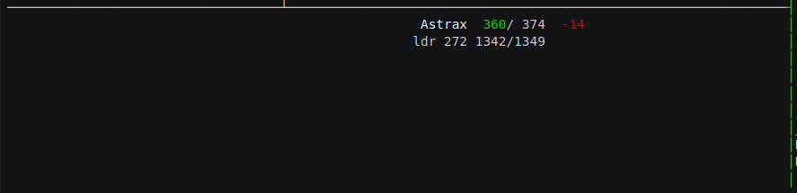
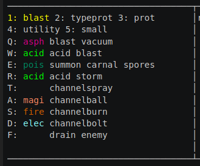
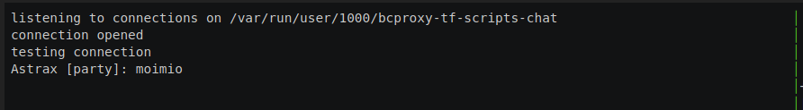

# bcproxy-enabled TinyFugue triggers

BatMUD in terminal with 2020s' scripting.

[](https://asciinema.org/a/EARFlkUe5bXPjYFVtRUARW3d4)

The goal of this project is to have a fast windowed BatMUD playing environment
in terminal with modern programming features. The main elements are
[TinyFugue](https://github.com/lotheac/tinyfugue) (with python),
[bcproxy](https://github.com/lotheac/bcproxy) and [tmux](https://github.com/tmux/tmux).


## batmux.conf

[tmux](https://github.com/tmux/tmux) configuration file to have windows (panes)
inside a terminal.

- Right half is the main TinyFugue pane
- Top left is party chat and tells (chat)
- Middle left is for spell binds help (caster)
- Bottom left is for party status (party)

Middle left has also some extra room for general statuses, which is yet to be done.

Communication from tf to different panes is done via unix socket using Python's
multiprocessing.connection.

## party&#46;py



Party status output and party member keyboard targetting.

This script uses batclient's party status message, which is updated more often
than normal `pss` from mud.

Missing features compared to `pss` is first of all minions: only nine actual
party members are reported. Ambush-status is also missing.

There are places for nine members plus seven minions or members with unknown
places. Targetting uses `alt-7`, `alt-8`, etc.

Each member has name, hp/hpmax, hpdiff; status, ep, sp/spmax and `*` if it
is the current target for prots and heals. Hp is colorized from green to red.
Name and status are colorized if member is unconscious, stunned, etc.

- [party.py](./party.py) triggers for reading status messages, targetting
- [partyoutput.py](./partyoutput.py) output printing
- [partytypes.py](./partytypes.py) types to be used in both scripts

## caster&#46;py



Spell casting.

The idea is to have multiple sets of different spells that can be cast
from keybindings. In the example, *blast*, *typeprot*, etc. can be selected
with `alt-1`, `alt-2`, etc. *blast vacuum*, *acid blast*, etc. can be cast with
`alt-q`, `alt-w`, etc.

Spells can be cast with or without target, depending on whether the spell
supports it. For example, *blast vacuum* can be cast at current target with
`shift-alt-q` and without target with `alt-q`.

- [caster.py](./caster.py) casting triggers and keybind handling
- [casteroutput.py](./casteroutput.py) spells help output
- [castertypes.py](./castertypes.py) types to be used in caster scripts
- [spells.py](./spells.py) definitions for spells
- [blaster.py](./blaster.py) spells for blaster (channumage in my case)
- [healer.py](./healer.py) spells for healer (tarma-only here)

## chat&#46;py



Tells and party chats to their own pane. Uses bcproxy's `chan_party` and
`chan_tell` channel keywords for triggering.

This is the simplest example of socket communication.

- [chat.py](./chat.py) triggers
- [chatoutput.py](./chatoutput.py) output


## resists&#46;py

```
Astrax [report]: Jacobi resists: acid: 0, asphyxiation: 20, magical: 40
```

Spell resists reporting to party report channel.

Reports are done only once for given mob and damage type, and all the damage
types are collected to the same row with increasing resist.

- [resists.py](./resists.py) triggers
- [spells.py](./spells.py) definitions for spells

## ginfo&#46;py

Guild information shortener.

```
Astrax [100]: channu-mage-asphy-acid-pois-inner magical duck, Finland
```

- [ginfo.py](./ginfo.py)


## channeller&#46;py

Channeller supply report message enumeration.

```
You feel a soothing inner warmth. You have a good supply of drained energy. (3/6)
```

- [channeller.py](./channeller.py)


# Installation and configuration

You need
- [TinyFugue](https://github.com/lotheac/tinyfugue) with python enabled
- [bcproxy](https://github.com/lotheac/bcproxy)
- [tmux](https://github.com/tmux/tmux)

Copy or symlink python scripts from this repository to TinyFugue's `tf-lib` directory.

Edit the [batmux.conf](./batmux.conf) to have correct paths to output scripts 
and start tmux:

    tmux new-session "tmux source-file ~/bat/bcproxy-tf-scripts/batmux.conf"

Start bcproxy and tf:

    ~/bat/bcproxy/obj/bcproxy 2901 & sleep 1 && tf -f~/bat/astrax.tfrc

Load the scripts (this can of course be done in your `.tfrc`):

    /python_load party
    /python_load resists
    /python_load blaster
    /python_load chat

